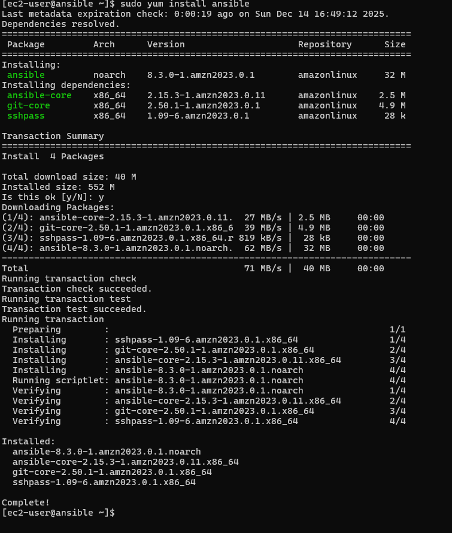
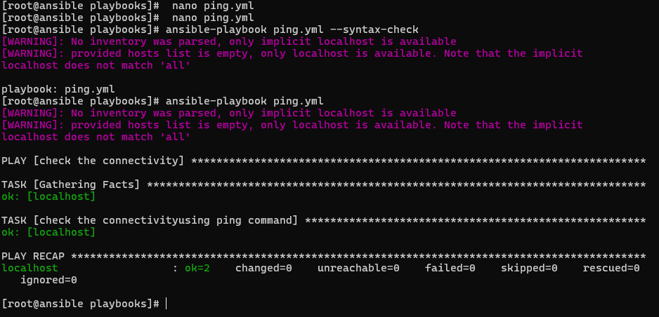
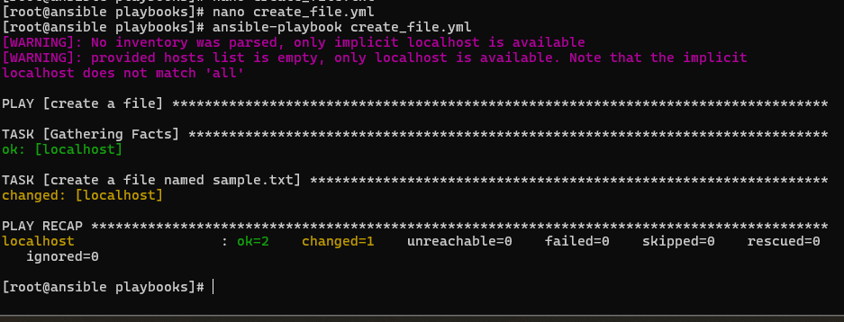

# 🚀 Ansible Basics: Installation, Ping Test & File Creation (Hands-On)

This repository contains my **basic Ansible practice** where I learned how to:

- Install Ansible on Amazon Linux
- Run a simple **ping playbook**
- Create a file using an Ansible playbook
- Understand inventory warnings and localhost execution

This project is focused on **learning Ansible fundamentals** with real commands and outputs.

---

## 📌 What I Practiced

- Installing Ansible using `yum`
- Writing basic Ansible playbooks
- Running playbooks on **localhost**
- Understanding Ansible warnings
- Using Ansible modules:
  - `ping`
  - `file`

---

## 🧱 Project Structure

```

ansible/
├── ping.yml
├── create_file.yml
├── img/
│   ├── install_ansible.png
│   ├── ansible_ping.png
│   └── create_file.png
└── README.md

````

---

## ⚙️ Step 1: Install Ansible

Ansible was installed on **Amazon Linux** using the `yum` package manager.

### Command Used

```bash
sudo yum install ansible -y
````

### Screenshot



This installs:

* ansible
* ansible-core
* sshpass
* git

---

## 📄 Step 2: Ping Playbook (Connectivity Test)

To test Ansible setup, I created a simple ping playbook.

### `ping.yml`

```yaml
- name: Check the connectivity
  hosts: localhost
  tasks:
    - name: check the connectivity using ping command
      ping:
```

### Syntax Check

```bash
ansible-playbook ping.yml --syntax-check
```

### Run Playbook

```bash
ansible-playbook ping.yml
```

### Output Screenshot



### Note on Warning

```
[WARNING]: No inventory was parsed, only implicit localhost is available
```

This warning appears because:

* No inventory file is defined
* Playbook runs on **localhost**
* This is expected and safe for learning/practice

---

## 📁 Step 3: Create File Using Ansible

Next, I created a playbook to generate a file using Ansible.

### `create_file.yml`

```yaml
- name: Create a file
  hosts: localhost
  tasks:
    - name: create a file named sample.txt
      file:
        path: /root/sample.txt
        state: touch
```

### Run Playbook

```bash
ansible-playbook create_file.yml
```

### Output Screenshot



The playbook successfully creates `sample.txt` on the system.

---

## 🧠 Key Learnings

From this practice, I learned:

* How to install Ansible on Linux
* How Ansible works with localhost
* How to write simple YAML playbooks
* How Ansible modules work
* What `ok` and `changed` mean in output
* Why inventory warnings appear
* Basic troubleshooting mindset for Ansible

---

## 🎯 Why This Project

This project helped me build confidence with Ansible basics before moving to:

* Inventory files
* Remote hosts
* Roles
* Ansible + AWS EC2 automation

It’s a strong starting point for anyone beginning Ansible.

---

## 👨‍💻 Author

**Raj Ahire**
AWS | DevOps | Terraform | Ansible | Automation

---


